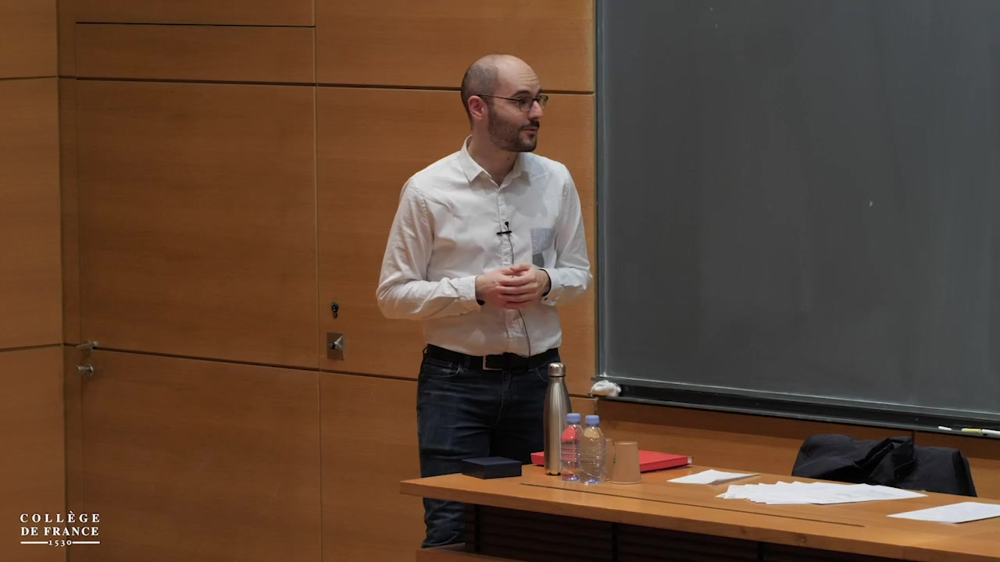
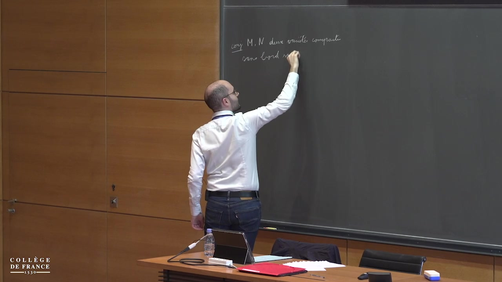
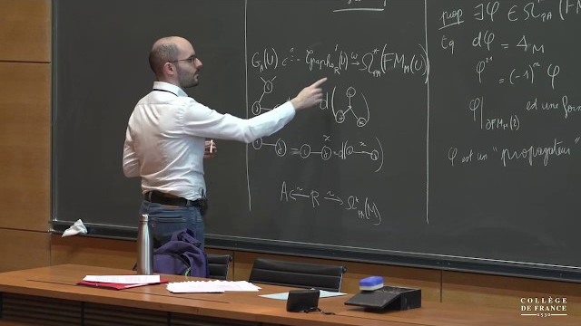
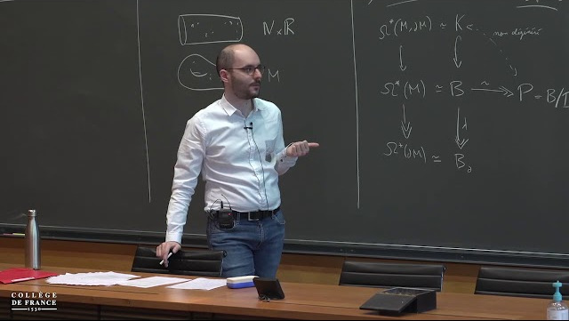

In this lecture, we will study the real homotopy type of configuration spaces of manifolds.
Configuration spaces consist in collections of pairwise distinct points in a given manifold.
The study of these spaces is a classical problem in algebraic topology.
An important question about configuration space is homotopy invariance: if a manifold can be continuously deformed into another one, then can the configuration spaces of the first manifold be continuously deformed in the configuration spaces of the second?
This question remains open if we consider simply connected closed manifolds.
In this lecture, we will see how to prove this conjecture in characteristic zero (i.e. if we restrict ourselves to algebro-topological invariants with real coefficients).
We will then consider a generalization to manifolds with boundary.
The proof involves ideas from the theory of operads, which will be introduced at the end of the lecture.

This lecture is based in part on joint works with Ricardo Campos, Julien Ducoulombier, Pascal Lambrechts, and Thomas Willwacher.

[** Lecture notes are available here.**](peccot.pdf)

An enhanced version, in English, of these lecture notes is in preparation.

## Practical informations

The lessons will take place at the Collège de France (11 place Marcelin-Berthelot, in the 5th district of Paris), in room 5.
They were initially planned on Wednesdays 4th, 11th, 18th, and 25th, March 2020, from 11AM to 1PM.
Due to the COVID-19 pandemic, the last two lessons were postponed respectively to May 25th and 28th (10AM--12PM) and were recorded without an audience.

### Lessons

  
  

    <h5 class="card-title">Lesson 1</h5>
    <h6 class="card-subtitle text-muted mb-2">March 4th 2020, 11:00–13:00</h6>
    
Chapter 1: Configuration spaces of manifolds

    <ul class="mb-2">
    <li>Generalities on configuration spaces sur les espaces de configuration</li>
    <li>Homotopy invariance conjecture</li>
    <li>Rational homotopy theory</li>
    <li>Formality of {{< tex "\mathrm{Conf}_{\mathbb{R}^n}" >}}</li>
    </ul>
    <a class="card-link" href="https://www.college-de-france.fr/site/cours-peccot/guestlecturer-2020-03-04-11h00.htm">Video </a>
  

  
  

    <h5 class="card-title">Lesson 2</h5>
    <h6 class="card-subtitle text-muted mb-2">March 11th 2020, 11:00–13:00</h6>
    
Chapter 2: The Lambrechts–Stanley model

    <ul class="mb-2">
    <li>Definition of the model and theorem</li>
    <li>Compactifications of configuration spaces</li>
    <li>Semi-algebraic sets and forms</li>
    <li>Definition of the unreduced graph complex – Propagator</li>
    </ul>
    <a class="card-link" href="https://www.college-de-france.fr/site/cours-peccot/guestlecturer-2020-03-11-11h00.htm">Video </a>
  

  
  

    <h5 class="card-title">Lesson 3</h5>
    <h6 class="card-subtitle text-muted mb-2">May 25th 2020 (online)</h6>
    
Chapter 2: The Lambrechts–Stanley model (continued)

    <ul class="mb-0">
    <li>Partition function and reduced graph complex</li>
    <li>Simplification of the partition function</li>
    <li>Quasi-isomorphism: combinatorial proof</li>
    </ul>
    
Chapter 3: Manifolds with boundary

    <ul class="mb-2">
    <li>Motivation: gluing</li>
    <li>Poincaré–Lefschetz duality models</li>
    </ul>
    <a class="card-link" href="https://www.college-de-france.fr/site/cours-peccot/guestlecturer-2020-05-25-11h00.htm">Video </a>
  

  
  

    <h5 class="card-title">Lesson 4</h5>
    <h6 class="card-subtitle text-muted mb-2">May 28th 2020 (online)</h6>
    
Chapter 3: Manifolds with boundary (continued)

    <ul class="mb-0">
    <li>Fulton–MacPherson compactifications</li>
    <li>Propagators</li>
    <li>Graph complexes</li>
    <li>Simplification of the partition functions</li>
    <li>End of the proof</li>
    <li>Perturbed Lambrechts–Stanley model</li>
    </ul>
    
Chapter 4: Operads

    <ul class="mb-2">
    <li>Quick introduction to the theory</li>
    <li>Definition of factorization homology</li>
    <li>Relationship with configuration spaces</li>
    </ul>
    <a class="card-link" href="https://www.college-de-france.fr/site/cours-peccot/guestlecturer-2020-05-28-11h00.htm">Video </a>
  

