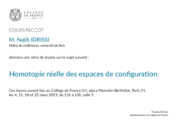

Du fait de la pandémie de COVID-19 qui sévit actuellement, les deux dernières leçons sont reportées à une date encore inconnue.

Dans ce cours, nous étudierons le type d'homotopie réel des espaces de configuration de variétés.
Les espaces de configuration consistent en des collections de points deux à deux distincts dans une variété donnée.
L'étude de ces espaces est un problème classique en topologie algébrique.
Une question importante à leur sujet est celle de l'invariance homotopique : si l'on peut déformer continûment une variété en une autre, est-ce que l'on peut déformer continûment les espaces de configuration de la première en les espaces de configuration de la seconde ?
Cette question reste ouverte si l'on se restreint aux variétés compactes sans bord simplement connexes.
Dans ce cours, nous verrons comment démontrer cette conjecture en caractéristique nulle (c'est-à-dire si l'on considère uniquement les invariants algébro-topologiques à coefficients réels).
Nous considérerons ensuite une généralisation aux variétés à bord.
La preuve fait intervenir des idées de la théorie des opérades, qui sera introduite à la fin du cours.

Ce cours sera en partie basé sur des travaux en collaboration avec Ricardo Campos, Julien Ducoulombier, Pascal Lambrechts et Thomas Willwacher.

**[ Des notes de cours sont disponibles ici.](peccot.pdf)**

## Informations pratiques

Les leçons se déroulent au Collège de France (11 place Marcelin-Berthelot, dans le 5ème arrondissement de Paris), en salle 5.
Elles auront lieu les mercredi 4, 11, 18 et 25 mars 2020 de 11h à 13h et sont ouvertes à toutes et tous.

[4 mars 11h–13h ](https://www.college-de-france.fr/site/cours-peccot/guestlecturer-2020-03-04-11h00.htm)
: Chapitre 1 : Espaces de configuration de variétés
  1. Généralités sur les espaces de configuration
  2. Conjecture de l'invariance homotopique
  3. Théorie de l'homotopie rationnelle
  4. Formalité de {{< tex "\mathrm{Conf}_{\mathbb{R}^n}" >}}

[11 mars 11h–13h ](https://www.college-de-france.fr/site/cours-peccot/guestlecturer-2020-03-11-11h00.htm)
: Chapitre 2 : Le modèle de Lambrechts--Stanley
  1. Définition du modèle et théorème
  2. Compactifications des espaces de configuration
  3. Ensembles et formes semi-algébriques
  4. Définition du complexe de graphes non-réduit -- Propagateur

<del>18 mars 11h–13h</del> (reporté)
: [résumé à venir]

<del>25 mars 11h–13h</del> (reporté)
: [résumé à venir]

## Plan

Le plan qui suit est sujet à changements (le découpage ne correspond pas exactement aux quatre leçons).

1. Introduction
    - Espaces de configuration
    - Invariance homotopique
    - Rappels sur la théorie de l'homotopie rationnelle
    - Formalité de {{< tex "\mathrm{Conf}(\mathbb{R}^n)" >}}
2. Modèle de Lambrechts--Stanley
    - Définition du modèle
    - Énoncé du théorème et idée de la preuve
    - Compactification de Fulton--MacPherson
    - Ensembles semi-algébriques et formes PA
    - Propagateur et définition du morphisme
    - Quasi-trivialité de la fonction de partition à homotopie près
    - Fin de la preuve
3. Variétés à bord
    - Motivation : calculer des espaces de configuration « inductivement »
    - Modèle 1 : recollements de variétés le long de leurs bords
    - Modèle 2 : modèle de Lambrechts--Stanley perturbé et paires à dualité de Poincaré--Lefschetz
    - Travail en cours : espaces de configuration de surfaces
4. Opérades
    - Motivation : homologie de factorisation
    - Introduction aux opérades
    - Structures opéradiques sur les compactifications
    - Formalité de Kontsevich (+ autres théorèmes de formalité)
    - Compatibilité du modèle de LS avec la structure opéradique
    - Exemple de calcul : {{< tex "\int_M \mathscr{O}_{\mathrm{poly}}(T\mathbb{R}^d[1-n])" >}}
