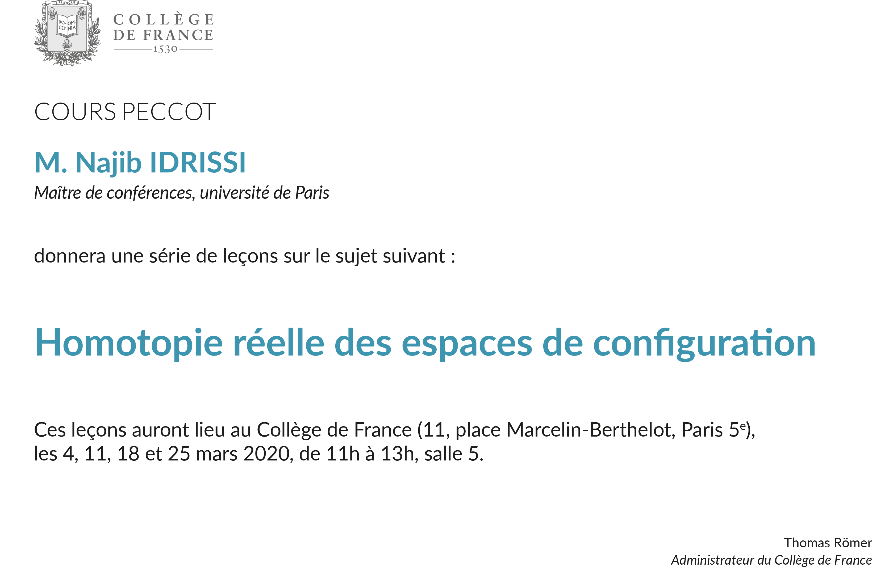

Dans ce cours, nous étudierons le type d'homotopie réel des espaces de configuration de variétés.
Les espaces de configuration consistent en des collections de points deux à deux distincts dans une variété donnée.
L'étude de ces espaces est un problème classique en topologie algébrique.
Une question importante à leur sujet est celle de l'invariance homotopique : si l'on peut déformer continûment une variété en une autre, est-ce que l'on peut déformer continûment les espaces de configuration de la première en les espaces de configuration de la seconde ?
Cette question reste ouverte si l'on se restreint aux variétés compactes sans bord simplement connexes.
Dans ce cours, nous verrons comment démontrer cette conjecture en caractéristique nulle (c'est-à-dire si l'on considère uniquement les invariants algébro-topologiques à coefficients réels).
Nous considérerons ensuite une généralisation aux variétés à bord.
La preuve fait intervenir des idées de la théorie des opérades, qui sera introduite à la fin du cours.

Ce cours sera en partie basé sur des travaux en collaboration avec Ricardo Campos, Julien Ducoulombier, Pascal Lambrechts et Thomas Willwacher.

<a href="peccot.pdf"><b> Des notes de cours sont disponibles ici.</b></a>

## Informations pratiques

Les leçons se déroulent au Collège de France (11 place Marcelin-Berthelot, dans le 5ème arrondissement de Paris), en salle 5.
Elles étaient initialement prévues les mercredi 4, 11, 18 et 25 mars 2020 de 11h à 13h.
À cause de la pandémie de COVID-19, les deux dernières ont été reportées respectivement les 25 et 28 mai de 10h à 12h et seront enregistrées sans public.

### Leçons

[4 mars 11h–13h ](https://www.college-de-france.fr/site/cours-peccot/guestlecturer-2020-03-04-11h00.htm)
: Chapitre 1 : Espaces de configuration de variétés
  - Généralités sur les espaces de configuration
  - Conjecture de l'invariance homotopique
  - Théorie de l'homotopie rationnelle
  - Formalité de {{< tex "\mathrm{Conf}_{\mathbb{R}^n}" >}}

[11 mars 11h–13h ](https://www.college-de-france.fr/site/cours-peccot/guestlecturer-2020-03-11-11h00.htm)
: Chapitre 2 : Le modèle de Lambrechts--Stanley
  - Définition du modèle et théorème
  - Compactifications des espaces de configuration
  - Ensembles et formes semi-algébriques
  - Définition du complexe de graphes non-réduit -- Propagateur

<del>18 mars 11h--13h</del> 
25 mai 10h--12h (en ligne)
: Chapitre 2 : Le modèle de Lambrechts--Stanley (suite)
  - Fonction de partition et complexe réduit
  - Simplification de la fonction de partition
  - Quasi-isomorphisme : preuve combinatoire
  
  Chapitre 3 : Variétés à bord
  - Motivation : recollements
  - Poincaré--Lefschetz duality models

<del>25 mars 11h--13h</del> 
28 mai 10h--12h (en ligne)
: [résumé à venir]
