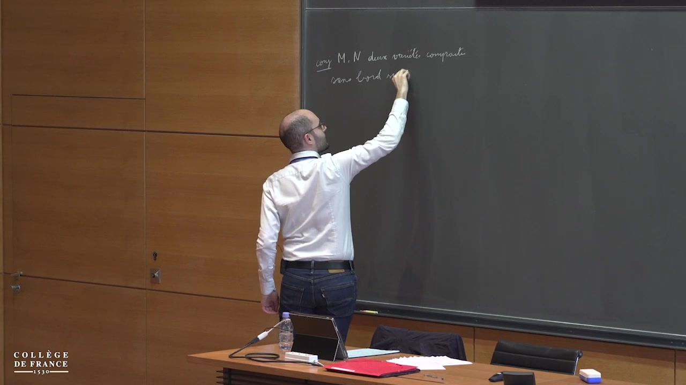
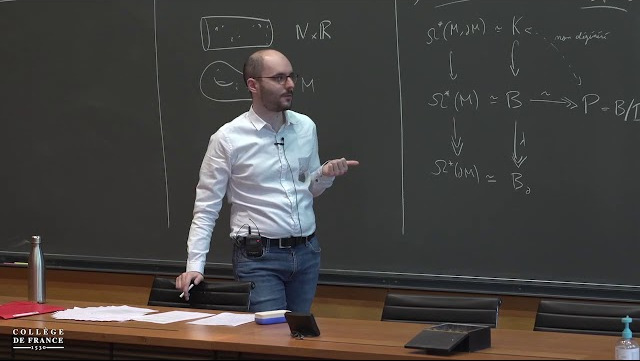

Dans ce cours, nous étudierons le type d'homotopie réel des espaces de configuration de variétés.
Les espaces de configuration consistent en des collections de points deux à deux distincts dans une variété donnée.
L'étude de ces espaces est un problème classique en topologie algébrique.
Une question importante à leur sujet est celle de l'invariance homotopique : si l'on peut déformer continûment une variété en une autre, est-ce que l'on peut déformer continûment les espaces de configuration de la première en les espaces de configuration de la seconde ?
Cette question reste ouverte si l'on se restreint aux variétés compactes sans bord simplement connexes.
Dans ce cours, nous verrons comment démontrer cette conjecture en caractéristique nulle (c'est-à-dire si l'on considère uniquement les invariants algébro-topologiques à coefficients réels).
Nous considérerons ensuite une généralisation aux variétés à bord.
La preuve fait intervenir des idées de la théorie des opérades, qui sera introduite à la fin du cours.

Ce cours sera en partie basé sur des travaux en collaboration avec Ricardo Campos, Julien Ducoulombier, Pascal Lambrechts et Thomas Willwacher.

<a class="alert-link" href="peccot.pdf"><i class="bi bi-file-earmark-text"></i>&nbsp;Lecture notes are available here.</a>

## Informations pratiques

Les leçons se déroulent au Collège de France (11 place Marcelin-Berthelot, dans le 5ème arrondissement de Paris), en salle 5.
Elles étaient initialement prévues les mercredi 4, 11, 18 et 25 mars 2020 de 11h à 13h.
À cause de la pandémie de COVID-19, les deux dernières ont été reportées respectivement les 25 et 28 mai de 10h à 12h et ont été enregistrées sans public.

### Leçons

  
  

    <h5 class="card-title">Leçon 1</h5>
    <h6 class="card-subtitle text-muted mb-2">4 mars 2020, 11h–13h</h6>
    
Chapitre 1 : Espaces de configuration de variétés

    <ul class="mb-2">
    <li>Généralités sur les espaces de configuration</li>
    <li>Conjecture de l’invariance homotopique</li>
    <li>Théorie de l’homotopie rationnelle</li>
    <li>Formalité de {{< tex "\mathrm{Conf}_{\mathbb{R}^n}" >}}</li>
    </ul>
    <a class="card-link" href="https://www.college-de-france.fr/site/cours-peccot/guestlecturer-2020-03-04-11h00.htm">Vidéo <i class="bi bi-play-circle"></i></a>
  

  
  

    <h5 class="card-title">Leçon 2</h5>
    <h6 class="card-subtitle text-muted mb-2">11 mars 2020, 11h–13h</h6>
    
Chapitre 2: Le modèle de Lambrechts–Stanley

    <ul class="mb-2">
    <li>Définition du modèle et théorème</li>
    <li>Compactifications des espaces de configuration</li>
    <li>Ensembles et formes semi-algébriques</li>
    <li>Définition du complexe de graphes non-réduit – Propagateur</li>
    </ul>
    <a class="card-link" href="https://www.college-de-france.fr/site/cours-peccot/guestlecturer-2020-03-11-11h00.htm">Vidéo <i class="bi bi-play-circle"></i></a>
  

  
  

    <h5 class="card-title">Leçon 3</h5>
    <h6 class="card-subtitle text-muted mb-2">25 mai 2020 (en ligne)</h6>
    
Chapitre 2 : Le modèle de Lambrechts–Stanley (suite)

    <ul class="mb-0">
    <li>Fonction de partition et complexe réduit</li>
    <li>Simplification de la fonction de partition</li>
    <li>Quasi-isomorphisme : preuve combinatoire</li>
    </ul>
    
Chapitre 3 : Variétés à bord

    <ul class="mb-2">
    <li>Motivation : recollements</li>
    <li>Modèles à dualité de Poincaré–Lefschetz</li>
    </ul>
    <a class="card-link" href="https://www.college-de-france.fr/site/cours-peccot/guestlecturer-2020-05-25-11h00.htm">Vidéo <i class="bi bi-play-circle"></i></a>
  

  
  

    <h5 class="card-title">Leçon 4</h5>
    <h6 class="card-subtitle text-muted mb-2">28 mai 2020 (en ligne)</h6>
    
Chapitre 3 : Variétés à bord (suite)

    <ul class="mb-0">
    <li>Compactifications de Fulton–MacPherson</li>
    <li>Propagateurs</li>
    <li>Complexes de graphes</li>
    <li>Simplification des fonctions de partition</li>
    <li>Fin de la preuve</li>
    <li>Modèle de Lambrechts–Stanley perturbé</li>
    </ul>
    
Chapitre 4 : Opérades 

    <ul class="mb-2">
    <li>Introduction rapide à la théorie</li>
    <li>Définition de l’homologie de factorisation</li>
    <li>Lien avec les espaces de configuration</li>
    </ul>
    <a class="card-link" href="https://www.college-de-france.fr/site/cours-peccot/guestlecturer-2020-05-28-11h00.htm">Vidéo <i class="bi bi-play-circle"></i></a>
  

