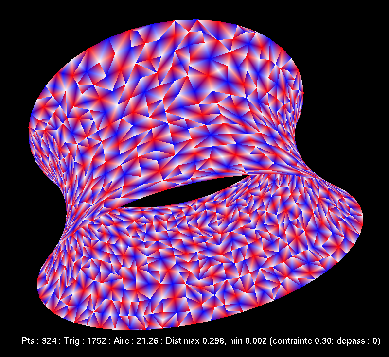
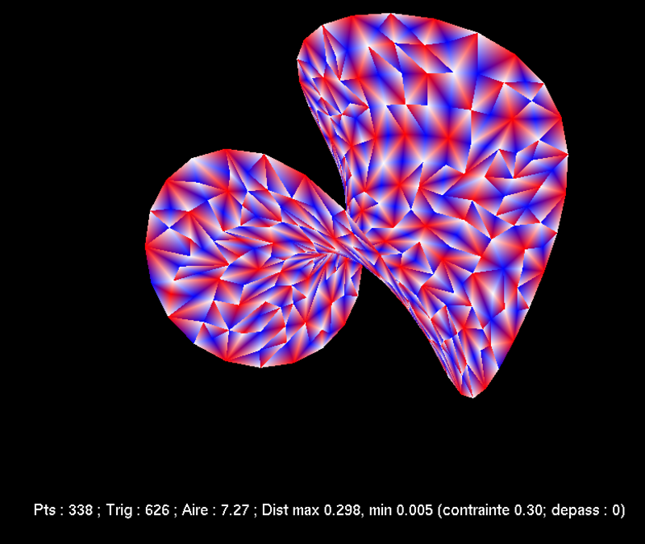
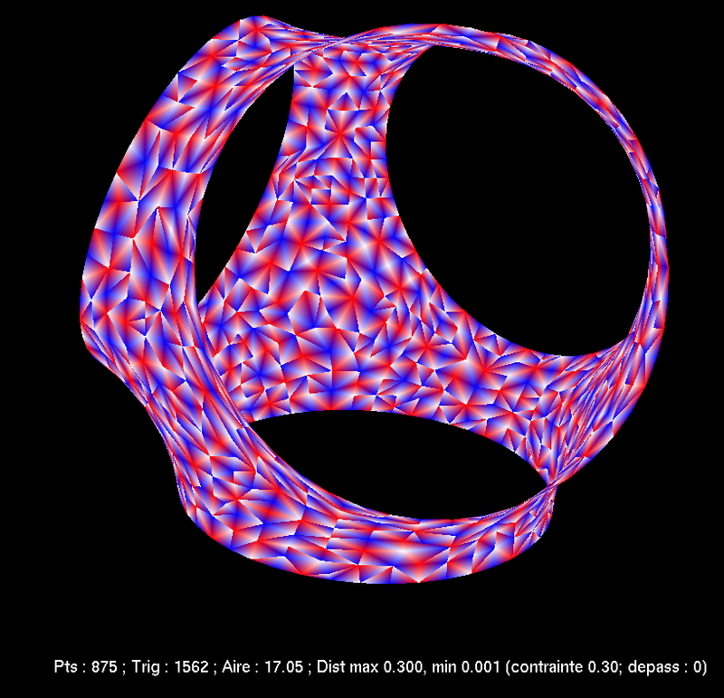

From January to June 2019, I organize a [reading seminar on homological stability]() with Mario Gonçalves Lamas following an idea of Muriel Livernet.

---

For the "Grandes Écoles" competitive entrance exams in 2011, I wrote a tiny program to find [minimal surfaces](https://en.wikipedia.org/wiki/Minimal_surface) with fixed boundary.
It's not very mature, it doesn't work all the time and it's not well-documented, but [it is available here.](minimale.zip)
To compile it, install OCaml, OCamlBuild, and the OpenGL libraries for OCaml.
Then run `ocamlbuild main.native`.
Controls are rudimentary: <kbd>SPC</kbd> to start/stop, left-click and scroll to move around, right-click to choose one of the four predefined boundaries, <kbd>s</kbd> to swap between full and hollow.
You then get images like this:

<figure class="figure col-md-4">

<figcaption class="figure-caption"><a href="https://fr.wikipedia.org/wiki/Cat%C3%A9no%C3%AFde">Catenoid</a>.</figcaption>
</figure>

<figure class="figure col-md-4">

<figcaption class="figure-caption"><a href="https://en.wikipedia.org/wiki/Enneper_surface">Enneper surface</a>.</figcaption>
</figure>

<figure class="figure col-md-4">

<figcaption class="figure-caption">Weird tetrahedron.</figcaption>
</figure>

I absolutely do not guarantee that the program is correct.
The surfaces found do resemble the theoretical ones, but I do not have a mathematical proof that they are the right ones.

---

I am active on [MathOverflow](https://mathoverflow.net/users/36146/najib-idrissi) and [Math StackExchange](https://math.stackexchange.com/users/10014/najib-idrissi).
