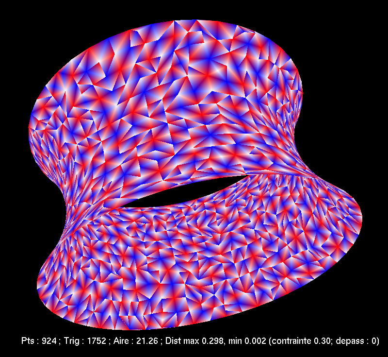

Je suis/fus membre des :

- [GDR Topologie Algébrique et Applications](http://gdrtop.math.cnrs.fr).
- (2014--2015) [Projet ANR « Homotopie algébrique, Opérades et groupes de Grothendieck--Teichmüller » (HOGT)](http://math.univ-lille1.fr/~operads/) coordonné par Benoit Fresse.
- (2021--2024) [Projet ANR « Higher Algebra, Geometry, and Topology » (HighAGT)](https://anr-highagt.pages.math.cnrs.fr/) coordonné par Bruno Vallette.

---

J'ai écrit un outil que j'ai appelé [arXiv2BibLaTeX](https://a2b.idrissi.eu) pour produire des entrées BibLaTeX à partir de prépublications arXiv.
Il est bien sûr open source : le code est sur [GitHub](https://github.com/nidrissi/a2b).

---

De janvier à juin 2019, j'ai organisé un [groupe de travail sur la stabilité homologique et les travaux de Galatius--Kupers--Randal-Williams]() avec Mario Gonçalves Lamas, sur une idée de Muriel Livernet.

---

Pour les concours d'entrée aux grandes écoles en 2011, j'ai écrit un tout petit programme pour trouver des [surfaces minimales](https://fr.wikipedia.org/wiki/Surface_minimale) à bord fixe.
Il n'est pas très mature, il ne marche pas toujours et il n'est pas bien documenté, mais [il est disponible ici](minimale.zip)
Pour le compiler, installez OCaml, OCamlBuild, et les bibliothèques OpenGL pour OCaml.
Ensuite lancez `ocamlbuild main.native`.
Les contrôles sont rudimentaires : <kbd>SPC</kbd> pour démarrer/arrêter, clic gauche et défilement pour bouger, clic droit pour choisir une des quatres courbes de bords prédéfinies, <kbd>s</kbd> pour changer entre plein et vide.
On obtient ces images :

<figure class="figure col-md-4">

<figcaption class="figure-caption"><a href="https://fr.wikipedia.org/wiki/Cat%C3%A9no%C3%AFde">Caténoïde</a>.</figcaption>
</figure>

<figure class="figure col-md-4">

<figcaption class="figure-caption"><a href="https://fr.wikipedia.org/wiki/Surface_d%27Enneper">Surface d'Enneper</a>.</figcaption>
</figure>

<figure class="figure col-md-4">

<figcaption class="figure-caption">Tétrahèdre bizarre.</figcaption>
</figure>

Je ne garantis absolument pas que le programme est correct.
Les surfaces trouvées ressemblent bien aux surfaces théoriques, mais je n'ai pas de preuve mathématique que ce sont les bonnes.

---

Je suis actif sur [MathOverflow](https://mathoverflow.net/users/36146/najib-idrissi) et [Math StackExchange](https://math.stackexchange.com/users/10014/najib-idrissi).

---

Ce site est construit à l'aide du générateur de sites webs statiques [Hugo](https://gohugo.io/) et une version fortement modifiée du thème [Academic](https://sourcethemes.com/academic/).
[La source est sur GitHub.](https://github.com/nidrissi/nidrissi)
J'y ai aussi mis mes [dotfiles](https://github.com/nidrissi/dotfiles).
