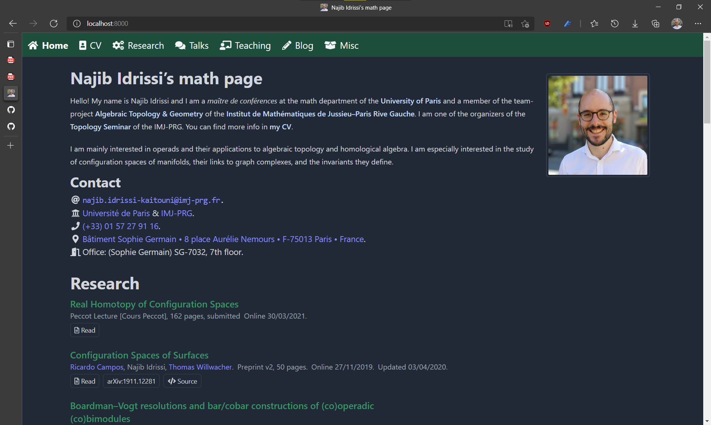

I just implemented a dark mode for my website!
I saw that it was quite easy to do with [TailwindCSS](https://tailwindcss.com/) so I took a shot at it.
To see it, enable dark mode in your browser/OS settings.
If you don't want to do that and you still want to see how it looks like, here is a screenshot:

If you have enabled dark mode and you want to see how the website looks like in "light" mode, [check out my earlier post](/post/gatsby) where I detail the transition to Gatsby.
