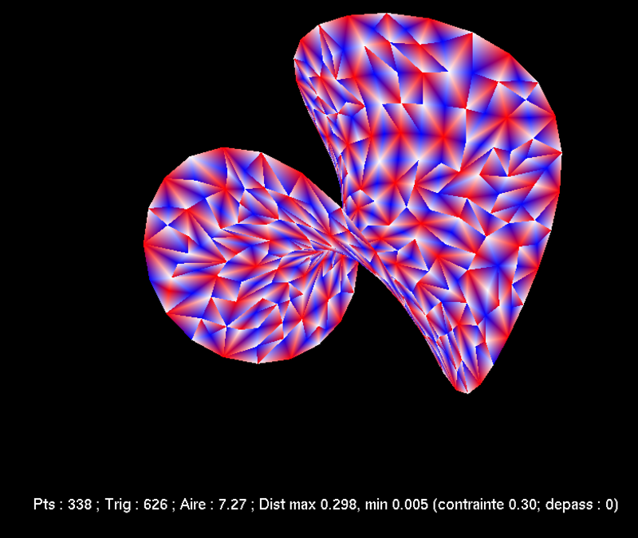

I dug up the tiny program I wrote to find [minimal surfaces](https://en.wikipedia.org/wiki/Minimal_surface) with fixed boundary in 2011 for the "grandes écoles" entrance exams.
Ah, the memories...

It's [available here](minimale.zip), along with some pictures.
It's written in OCaml, of course!
To compile it, install OCaml, OCamlBuild, and the OpenGL libraries for OCaml.
Then run `ocamlbuild main.native`.
Controls are rudimentary: <kbd>SPC</kbd> to start/stop, left-click and scroll to move around, right-click to choose one of the four predefined boundaries, <kbd>s</kbd> to swap between full and hollow.
You then get images like this:

<figure class="figure col-md-4">

<figcaption class="figure-caption"><a href="https://fr.wikipedia.org/wiki/Cat%C3%A9no%C3%AFde">Catenoid</a>.</figcaption>
</figure>

<figure class="figure col-md-4">

<figcaption class="figure-caption"><a href="https://en.wikipedia.org/wiki/Enneper_surface">Enneper surface</a>.</figcaption>
</figure>

<figure class="figure col-md-4">

<figcaption class="figure-caption">Weird tetrahedron.</figcaption>
</figure>

I absolutely do not guarantee that the program is correct.
The surfaces found do resemble the theoretical ones, but I do not have a mathematical proof that they are the right ones.
