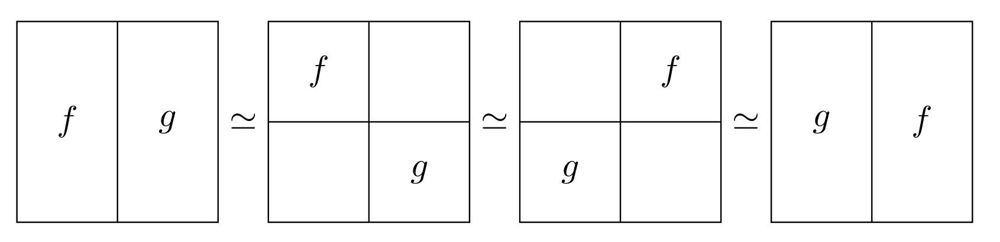
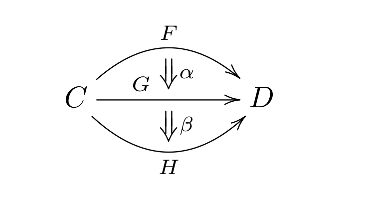
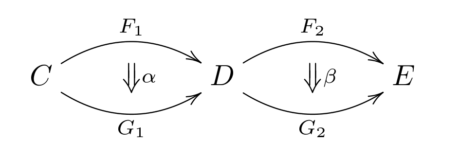

As promised, this post is about the famous [Eckmann--Hilton argument](https://en.wikipedia.org/wiki/Eckmann%E2%80%93Hilton_argument). This argument, on the surface, looks like a simple algebraic trick; but it has deep consequences, which I will now try to explain. This post is an expanded version of a [math.SE answer](https://math.stackexchange.com/a/1203969/10014) I wrote some time ago.

## Some background

When I was a first-year student at the ENS, we had to write a "_Mémoire de première année_" ("First-year essay") on a topic. I wrote mine together with Maxence Novel, with Grégory Ginot as advisor, about the Eckmann--Hilton argument. You can find it [here](./eckmann-hilton.pdf) (it's in French; bear in mind that we were undergrads when we wrote this).

This was my first exposure to many topics: algebraic topology, operads, $\infty$-categories... And it definitely shaped up my current mathematical interests. I still remember trying to read Lurie's _Higher Algebra_ armed only with point-set topology and basic category theory! Needless to say I didn't get very far. I very much enjoyed the experience anyway.

## The argument

Without further ado, here is the theorem:

**Theorem (Eckmann--Hilton argument).** Let $M$ be a set equipped with two [monoid](https://en.wikipedia.org/wiki/Monoid) structures $(M,*)$ and $(M, \cdot)$ sharing the same unit $1 \in M$. Assume that they satisfy the _interchange law_:

$$
(a \cdot b) * (c \cdot d) = (a * c) \cdot (b * d).
$$

Then both structures are equal ($a * b = a \cdot b$) and moreover they are commutative ($a * b = b * a$).

Basically, what this means is that if you have a set with two "compatible" laws on it, then they are equal _and commutative_. It's rather powerful. This theorem can be further refined: you don't need to assume that both laws have the same unit, and you don't even have to assume that they are commutative. It all follows from the interchange law. But for the sack of simplicity I'll stick with these assumptions.

The proof is amazingly concise:

$$
\begin{align} a * b & = (a \cdot 1) * (1 \cdot b) \\ & = (a * 1) \cdot (1 * b) \\ a * b & = a \cdot b \\ & = (1 * a) \cdot (b * 1) \\ & = (1 \cdot b) * (a \cdot 1) \\ a * b & = b * a. \end{align}
$$

Pretty nifty!

### Interpretation

One can reformulate the interchange law: it is equivalent to the fact that $* : (M, \cdot)^2 \to (M, \cdot)$ is a morphism of monoids, and also equivalently, $\cdot : (M, *)^2 \to (M, *)$ is a morphism of monoids. Thus we get a reformulation of the Eckmann--Hilton argument (sorry folks, this blog will contain a lot of category theory):

**Reformulation.** A [monoid object](https://en.wikipedia.org/wiki/Monoid_(category_theory)) in the category of monoids is an abelian monoid.

Reformulated in this way, the argument immediately generalizes. Let $(\mathsf{C}, \otimes)$ be a monoidal category. The category $\mathsf{Mon}(\mathsf{C})$ is the category of monoid objects in $\mathsf{C}$: its objects are triplet $(M, \mu, \eta)$, where $M$ is an object of $\mathsf{C}$, $\mu : M^2 \to M$ and $\eta : 1_{\mathsf{C}} \to M$ satisfy the axioms of a monoid (associativity, unitality).

If $\mathsf{C}$ is symmetric monoidal, then $\mathsf{Mon}(C)$ can be equipped with a tensor product. If $(M, \mu, \eta)$ and $(M', \mu', \eta')$ are two monoids, their tensor product is defined to be $(M \otimes M', \tilde{\mu}, \eta \otimes \eta')$, where $\tilde{\mu}$ is the composite (I'm forgetting about associativity constraints):

$$
M \otimes M' \otimes M \otimes M' \cong M \otimes M \otimes M' \otimes M' \xrightarrow{\mu \otimes \mu'} M \otimes M'.
$$

So one can speak about monoid objects inside $\mathsf{Mon}(\mathsf{CC})$. Then the Eckmann--Hilton argument says:

**Theorem.** Let $(\mathsf{C}, \otimes)$ be a symmetric monoidal category. Then the category of monoid objects in $\mathsf{Mon}(\mathsf{C})$ is equivalent to the category $\mathsf{Mon}_{ab}(\mathsf{C})$ of abelian monoids in $\mathsf{C}$.

The proof is exactly the same as before, except that you need to translate it into commutative diagrams.

## First applications

### Fundamental groups of H-spaces

An _H-space_ is a space $X$ equipped with a "multiplication" $\mu : X^2 \to X$ which is unital up to homotopy: there exists $e \in X$ such that both $\mu(e, -)$ and $\mu(-,e)$ are homotopic to the identity of $X$. Topological monoids are examples of H-spaces.

Then the Eckmann--Hilton argument can be used to show that the [fundamental group](https://en.wikipedia.org/wiki/Fundamental_group) $\pi_1(X,e)$ is commutative. Indeed, this fundamental group has two multiplications: the usual concatenation of loops $*$, and the multiplication of loops $\cdot$ induced by $\mu$, given by:

$$
(\gamma \cdot \gamma')(t) = \mu(\gamma(t), \gamma'(t)).
$$

These two laws are unital (the unit being the class of the constant loop equal to $e$), and they are compatible in the sense of Eckmann--Hilton. It thus follows:

1. That these laws are equal, meaning that the concatenation of two loops is homotopic to their product with $\mu$;
2. And commutative, meaning that the concatenation of two loops is homotopic to their concatenation in the reverse order!

This has immediate consequences: a space like $S^1 \vee S^1$ with a nonabelian fundamental group cannot be given an H-space structure.

### Higher homotopy groups

This section can be summarized by this picture:

It is a depiction of the Eckmann--Hilton argument applied to $\pi_2(X)$. To understand it, consider a set $M$ with two monoid structures; instead of writing them with two different operators, represent one of them with horizontal multiplication and the other with vertical multiplication, like this:

$$
a * b = \begin{pmatrix} a & b \end{pmatrix}, \qquad a \cdot b = \begin{pmatrix} b \\ a \end{pmatrix}.
$$

The interchange law then exactly says that this multiplication is not ambiguous:

$$
\begin{pmatrix} c & d \\ a & b \end{pmatrix}
$$

One can either multiply first each line horizontally and then vertically to get $(a * b) \cdot (c * d)$, or first each column vertically and then horizontally to get $(a \cdot c) * (b \cdot d)$, and both are equal by the interchange law. The proof of the Eckmann--Hilton argument then goes like this:

$$
\begin{align} \begin{pmatrix} a & b \end{pmatrix} & = \begin{pmatrix} 1 & b \\ a & 1 \end{pmatrix} \\ & = \begin{pmatrix} b \\ a \end{pmatrix} \\ & = \begin{pmatrix} b & 1 \\ 1 & a \end{pmatrix} \\ & = \begin{pmatrix} b & a \end{pmatrix} \end{align}
$$

This is very similar to the picture at the beginning of the section! To understand it, recall that the second fundamental group $\pi_2(X,e)$ can be defined as the set:

$$
\pi_2(X,e) = \{ \gamma : [0,1]^2 \to X \mid \gamma(\partial [0,1]^2) = \{ x_0 \} \} / \sim
$$

quotiented out by homotopy of maps. Since the square $[0,1]^2$ is two-dimensional, $\pi_2(X,e)$ has two composition laws: concatenation in the horizontal direction, and concatenation in the vertical direction. Both are associative, and they satisfy the interchange law (the reader is advised to draw a picture), so by the Eckmann--Hilton argument, both are equal and commutative! And the proof looks just like the picture at the beginning of the section.

_Remark._ This can be deduced from the fact that the fundamental group of an H-space is abelian. Indeed, $\pi_2(X) \cong \pi_1(\Omega X)$, where $\Omega X$ is the loop space of $X$; since $\Omega X$ is an H-space (by concatenation of loops), then its fundamental group is abelian. By induction $\pi_n(X)$ is abelian for all $n$.

### Monoids and comonoids

Let $\mathsf{C}$ be a cartesian closed category. A _comonoid_ in $\mathsf{C}$ is a monoid in the opposite category $\mathsf{C}^{op}$, equipped with the tensor product given by the categorical coproduct. More explicitly, it's an object $X$ equipped with a "comultiplication" $\Delta : X \to X \sqcup X$ and a "counit" $\epsilon : X \to *$ satisfying axioms formally dual to that a of a monoid.

Then if $M$ is a monoid in $\mathsf{C}$ (with respect to the tensor product given by the categorical product), the hom-set $\hom_{\mathsf{C}}(X,M)$ is equipped with two different multiplications: given $f,g : X \to M$, one can either consider $f*g : X \to M$ given by $X \xrightarrow{\Delta} X \sqcup X \xrightarrow{f \sqcup g} M$, or $f \cdot g$ given by $X \xrightarrow{(f,g)} M \times M \xrightarrow{\mu} M$. One can then check that both are compatible in the sense of Eckmann--Hilton, thus $\hom_{\mathsf{C}}(X,M)$ is a commutative monoid.

This is a generalization of the fact about the fundamental groups: let $\mathsf{C} = \mathsf{Top}_*$ be the category of pointed topological spaces. Then $S^1$, equipped with the "pinch map" $S^1 \to S^1 \vee S^1$ that collapses two points, is a comonoid up to homotopy; hence if $M$ is an H-space, then $[S^1, M] =: \pi_1(M)$ is abelian.

## Center of a category

### Variant 1

Natural transformations between functors can be composed in two different ways:

1. If $F,G,H : \mathsf{C} \to \mathsf{D}$ are functors and $\alpha : F \to G$ and $\beta : G \to H$ are natural transformations, then there is a "vertical composite" $\beta \circ \alpha : F \to G$ given component-wise by $(\beta \circ \alpha)_X = \beta_X \circ \alpha_X$: 2. If $F_1, G_1 : \mathsf{C} \to \mathsf{D}$ and $F_2, G_2 : \mathsf{D} \to \mathsf{E}$ are functors and $\beta : F_1 \to G_1$, $\beta : F_2 \to G_2$ are natural transformation, there is an horizontal composite $\alpha * \alpha$.

So if one only considers natural transformations from the identity functor $\operatorname{id}_{\mathsf{C}}$ to itself, one gets two different composition laws on $Z(\mathsf{C}) = \operatorname{End}(\operatorname{id}_{\mathsf{C}})$. Again these two laws satisfy the interchange law, and thus $Z(C)$, called the _center_ of the category $\mathsf{C}$, is abelian. If $\mathsf{C}$ is a monoid seen as a category with one object, then $Z(\mathsf{C})$ is the usual center of the monoid.

### Variant 2

Let $(\mathsf{C}, \otimes, 1)$ be a monoidal category. Then endomorphisms of the unit objects can be multiplied in two ways: the usual composition of morphisms, or a kind of convolution given by $f * g : 1 \cong 1 \otimes 1 \xrightarrow{f \otimes g} 1 \otimes 1 \cong 1$

Then both laws are compatible (this isn't easy to check!), and thus in a monoidal category, $\operatorname{End}(1)$ is abelian. This implies that if an object $X$ in some category has nonabelian monoid of endomorphisms, then that category cannot be given a monoidal structure with $X$ as the unit.

### Common generalization

Both variants can be generalized by looking at bicategories. If $\mathscr{C}$ is a bicategory and $X$ is an object, then the endomorphisms $\operatorname{End}(\operatorname{id}_X)$ of the identity of $X$ forms an abelian monoid, just like in variant 1.

1. By taking $\mathscr{C} = \mathsf{Cat}$, one exactly recovers variant 1;
2. If $\mathsf{C}$ is a monoidal category, then its "suspension" $\Sigma \mathsf{C}$ is a bicategory with one object; 1-morphisms are objects of $\mathsf{C}$, while 2-morphisms are morphisms of $\mathsf{C}$. Horizontal composition is given by tensor product of objects and vertical composition by composition in $\mathsf{C}$. Then the endomorphisms of $* \in \Sigma \mathsf{C}$ (seen as a bicategory) is exactly the center of $\mathsf{C}$ (seen as a monoidal category as in variant 2).

### Different variant: the Drinfeld center

There exists another, completely different notion of center of a monoidal category, called the _Drinfeld center_ (independently due to Drinfeld and Joyal--Street). It is morally the categorification of the notion of center of a monoid (a monoidal category is the same thing as a monoid in the category of categories).

Unlike everything we've seen so far, the Drinfeld center of a monoidal category isn't a "commutative" (symmetric) monoidal category -- it's a **braided** monoidal category, something in-between a monoidal category and a symmetric monoidal category. A braided monoidal category is a monoidal category $(\mathsf{C}, \otimes)$ equipped with a braiding, that is a natural isomorphism $\tau_{X,Y} : X \otimes Y \to Y \otimes X$ satisfying some coherence equations; but unlike a symmetric monoidal category, $\tau_{Y,X} \circ \tau_{X,Y}$ is not the identity of $X \otimes Y$.

Given a monoidal category $\mathsf{C}$, the Drinfeld center $\mathscr{Z}(\mathsf{C})$ has for objects pairs $(X, \Phi)$, where $X$ is an object of $\mathsf{C}$ and $\Phi$ is a half-braiding: a natural isomorphism $X \otimes - \to - \otimes X$. Composition, tensor product and braided structure are defined in the obvious way (the unconvinced reader is encouraged to write down commutative diagrams). Then:

**Theorem [Drinfeld, Joyal--Street].** The center $\mathscr{Z}(\mathsf{C})$ is a braided monoidal category.

The Drinfeld center also has a completely abstract definition: it is the monoidal category of endo-2-functors of the suspension $\Sigma \mathsf{C}$ (the 2-category with one object associated to $\mathsf{C}$).

For those interested, I wrote [a paper](https://arxiv.org/abs/1507.06844) explaining how algebras on the groupoid of the Swiss-Cheese operad are "the same thing" as triples $(\mathsf{M}, \mathsf{N}, F)$ where $\mathsf{N}$ is a monoidal category, $\mathsf{M}$ is a braided monoidal category, and $F : \mathsf{M} \to \mathscr{Z}(\mathsf{N})$ is a braided monoidal functor. I intend to speak more about that later.

## $k$-fold monoidal categories

The Drinfeld center is, in many respects, the "correct" notion of center for a monoidal category -- but it is not symmetric, only braided. There is some amount of commutativity lost when one goes to higher dimensional category theory. This is explained by Baez and Dolan in their article (cf. [References](#references)) through $k$-tuply monoidal $n$-categories, an $n$-category equipped with $k$ different "compatible" monoidal structures.

By the Eckmann--Hilton argument, all these monoidal structures are equal, but the amount of commutativity one gets changes depending on $n$ and $k$. These types of categories eventually stabilize to a "fully symmetric" structure for $k > n + 1$, as in this table (Table 21 in (Baez and Dolan)):

| | $n=0$ | $n=1$ | $n=2$
-|-|-|-|-
$k=0$ | sets | categories | 2-categories
$k=1$ | monoids | monoidal categories | monoidal 2-categories
$k=2$ | commutative monoids | braided monoidal categories | braided monoidal 2-categories
$k=3$ | " | symmetric monoidal categories | weakly involutory monoidal 2-categories
$k=4$ | " | " | strongly involutory monoidal 2-categories
$k=5$ | " | " | "

This _Stabilization Hypothesis_ is one of the features that is expected of any good notion of $\infty$-categories, inspired by the Freudenthal suspension theorem. The notion of $k$-fold monoidal categories also appears to be linked to the theory of $E_k$-operads (cf. (Balteanu et al.)), something on which I intend to speak later (cliff-hanger!).

## References

- Beno Eckmann and Peter J. Hilton. “Group-like structures in general categories. I. Multiplications and comultiplications”. In: _Math. Ann._ 145 (1961--1962), pp. 227--255. ISSN: 0025-5831. [MR0136642](https://www.ams.org/mathscinet-getitem?mr=0136642).
- Shahn Majid. “Representations, duals and quantum doubles of monoidal categories”. In: _Proceedings of the Winter School on Geometry and Physics (Srní, 1990)_. 26. 1991, pp. 197--206. [MR1151906](https://www.ams.org/mathscinet-getitem?mr=1151906). _(Note: Majid cites a personal communication of Drinfeld where Drinfeld tells him about the Drinfeld center.)_
- André Joyal and Ross Street. “Tortile Yang-Baxter operators in tensor categories”. In: _J. Pure Appl. Algebra_ 71.1 (1991), pp. 43--51. ISSN: 0022-4049. DOI: [10.1016/0022-4049(91)90039-5](http://dx.doi.org/10.1016/0022-4049(91)90039-5>). [MR1107651](https://www.ams.org/mathscinet-getitem?mr=1107651).
- John C. Baez and James Dolan. “Higher-dimensional algebra and topological quantum field theory”. In: _J. Math. Phys._ 36.11 (1995), pp. 6073--6105. ISSN: 0022-2488. DOI: [10.1063/1.531236](http://dx.doi.org/10.1063/1.531236). arXiv: [q-alg/9503002 [math.QA]](https://arxiv.org/abs/q-alg/9503002). [MR1355899](https://www.ams.org/mathscinet-getitem?mr=1355899).
- Cornel Balteanu, Zbigniew Fiedorowicz, Roland Schwänzl, and Rainer M. Vogt. “Iterated monoidal categories”. In: _Adv. Math._ 176.2 (2003), pp. 277--349. ISSN: 0001-8708. DOI: [10.1016/S0001-8708(03)00065-3](http://dx.doi.org/10.1016/S0001-8708(03)00065-3>). arXiv: [math/9808082 [math.AT]](https://arxiv.org/abs/math/9808082). [MR1982884](https://www.ams.org/mathscinet-getitem?mr=1982884).
