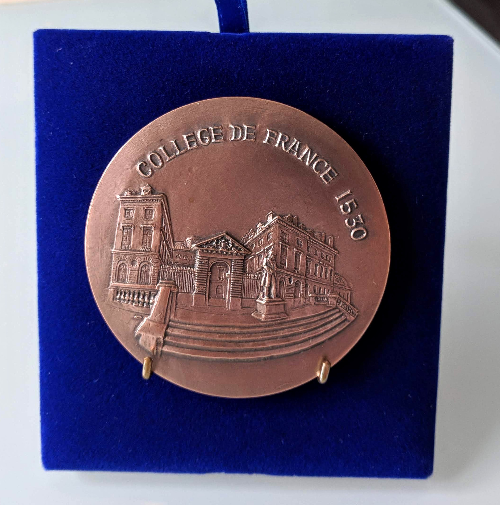

Yesterday was my first [Peccot lecture](/class/peccot)!
I think it went okay.
The video is going to be available soon [on this webpage](https://www.college-de-france.fr/site/cours-peccot/guestlecturer-2020-03-04-11h00.htm).
I mainly talked about the background for my course: what are configuration spaces, why do we care about them, what do we know about them, and what we would like to know about them.

I also got this medal 🙂.

