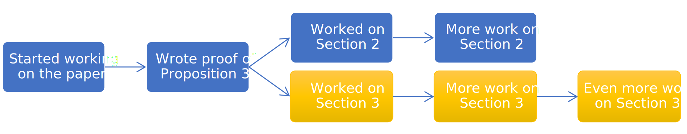
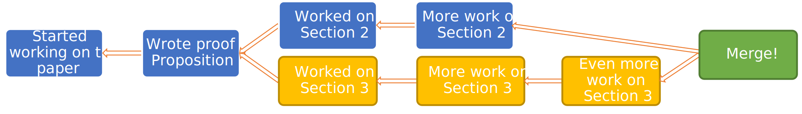
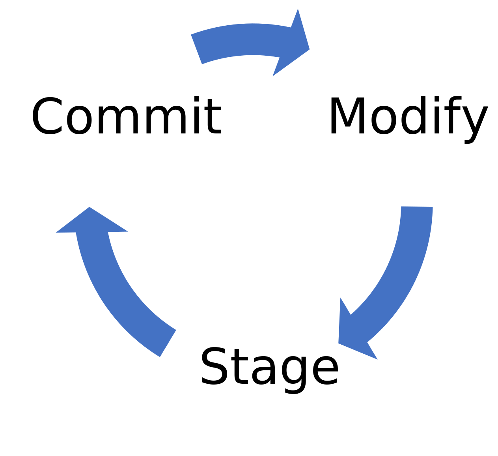

This post is the second in a series in which I will try to explain how to use Git to write papers, with an audience of professional mathematicians in mind.
[The first part, which was about why one would want to use Git, is here.]()
Let us now dive into the second part, in which I explain a little what's going "under the hood" of Git.

While it is not strictly necessary to know all this to use Git, I think that understanding the mechanics helps in actually using it correctly and efficiently.
Commands like `git push` or `git pull` are actually a bit complex and it is useful to know what words like "commit", "branch", "remote", etc. refer to, especially when there is a conflict between branches.

<!--more-->

Of course, I will not be able to explain <em>everything</em> about Git's inner workings!
That is what the <a href="https://git-scm.com/docs">reference documentation</a> is for.

## Commits

Since this post is intended for mathematicians, I hope that I can get away with some mathematical terminology.
For a given Git repository, the history is stored as a **rooted directed graph (without directed cycles) with marked vertices**.
Quite a mouthful, isn't it?
Let me try to explained what this all means.

- The history is a graph.
  Its vertices are called the **commits**.
  A commit represents a state of the repository, i.e., what the contents of all the files at that point in history where.
  This is what you see if you type `git log` in a repository (see the next post for what that means).
  Moreover, every commit has some metadata associated to it:
  - Its _author_, which is the user that made the modifications in the commit.
    (There is also a _committer_, which is the user who actually committed the changes in the repository; the two are typically one and the same, but not always.)
  - A _date_, i.e., when the commit was authored.
  - A _message_, written by the author, which summarizes the commit.
    This is typically used to write some information about what was changed in commit.
- So far, I have only described the vertices of the graph.
  There is an additional piece of metadata about every commit that actually makes the history into a graph: the **parent commit**.
  This is simply the point in time from which the author in order to write their modifications.
  A typical history of a single-author git repository could look like this:

  

  (If only writing a paper took four tries!)
  This relation is asymmetrical: one commit is identified as the parent, and one is identified as the child.
  This makes the graph into a _directed_ graph.
  An edge of the graph can be thought of as a list of changes from one commit to the next.
  This is what you see when you run `git diff`.
  It's not possible to create a loop in the history, so this graph has no directed cycles.

- Everything has to start somewhere.
  There is one special commit which has no parent, the **initial commit** (the root, in mathematical terms).
  This commit is the beginning of the history of the repository.
  It simply represents the first time that files have been committed to the repository.

- So far, what I have described is a rooted tree: the history starts somewhere, then users commit files and changes starting from somewhere.
  As soon as two or more people start working on the same repository (or the same person from different computers), the history can split in two or more directions.
  For example, authors A and B could start working from a common basis, author A makes some changes to Section 2, and author B makes some changes to Section 3 (or Section 2!).
  This could look like this (blue is author A, yellow is author 2):

  

  At some point, the two sets of changes need to be reconciled.
  In Git parlance, this is called merging.
  Special commits called **merge commits** can have two parents or more.
  (I say special, but this is a commit like any other, so it has an author, a date, etc.)
  After such a commit, the history looks like this:

  

  If all goes well (i.e., there are no conflicting changes) then Git is able to automatically reconcile the changes.
  In that case, the merge commit will merely contain the information that the histories were merged without hiccups.
  Otherwise, there is what is called a merge conflict, which needs to be resolved manually.
  This can sound intimidating, but 1. Git helps you do it, and 2. if you were writing the paper in the old-school way and two authors wrote conflicting changes to the file at the same time, what would happen?
  Git at least gives you a heads up, prevents you from blindly overwriting your coauthor's changes, and tells you exactly where the issue is.
  (See the next post for how to do it concretely).

From all the metadata of a commit, Git computes a commit ID.
This commit ID is an [SHA-1 hash](https://en.wikipedia.org/wiki/SHA-1), which typically looks like this: `4303a91e4e4f5fedceead0d4dfe939471451e65d`.
These commits IDs depend on all the metadata, including the parent commits; since the parent commits depend themselves on their own parents, and so on, up until the initial commit.
A reference to a commit thus depends on the whole history of the repository up to that point.
This is useful to note, as some commands can be used to rewrite history; but any rewrite will change all the commit IDs.

## Staging

Alright, now we know what the history of a Git repository looks like.
But in practice, how does one actually append changes into that history?

In an addition to the history (which contains the commits), Git has a notion called the "staging area".
As you modify files in a repository, your actual files will diverge from what Git considers to be the latest version of the repository.
Before actually committing changes to the history, you need to explicitly "stage" them.
Concretely, this means that you select the changes that you want to insert into the history.
Once these changes are selected and you are satisfied, you would then insert the changes to history, creating a new commit whose parent is the previous commit, with a message that explains your changes.
A typical workflow looks like this:

This notion of staging is useful for various reasons, compared to blindly committing everything that's changed in your repository:

- You may have modified many different files but you may not want to commit them just yet, as you don't consider these changes to be done.
- It is in fact possible to choose individual lines of a file to be committed.
  This can be useful if for example you are happy with the changes you've made to Section 2, forgot to commit, started working on Section 3, then remembered to commit ("save") but you don't want to commit Section 3 yet.
- You may also want to group changes logically.
  For example, if you have modified five files, but two of them are related to one change and three to another change, then it makes sense to make two different commits.
  In that case, you don't have to commit as soon as you want to group a set of changes together: you can group them after the fact.
- You may not want to include _every_ file in the Git history.
  For example, it's not a good idea to include LaTeX's `.aux` files, or the `.pdf` files, as they take up a lot of space, can be recreated at will, and the changes therein are not interesting (for example, if you compile the PDF on one day, then you compile it the next day, the PDF metadata will change, but that's not really something you are interested in recording).
  In that case, you would simply not commit the files that you don't want to record.

Git has some features that help you with this:

- If you don't care about grouping logically file changes or anything like that, then Git has an option to stage and commit all modified files in one fell swoop.
- You can also tell Git to ignore some files (e.g. the PDF).
  Git will not offer you to stage those files, and the commands that stage every file will not stage those.

## Pointers

### Branches

As we saw before, the history of a Git repository can get pretty complicated.
The "latest version" can be difficult to determine: in the image with the forked history (before the merge commit), is the "latest version" the commit labeled
"More work on Section 2", or the one "Even more work on Section 3"?

Another (more "advanced" but related) thing that you may want to consider is when you want to start working on a file without touching to what is considered the "main" version of the paper.
For example, you may have an idea for a new proof of Proposition 3, and you want to start rewriting it, but you may want to be able to easily go back to the "main" version.
Moreover, while you are going off on your tangent, you may also want to make changes to the "main" version of the paper and immediately make them available to your coauthors.

Branches are a solution to these questions.
A branch is merely a **named pointer** to a specific commit.
Nothing more, nothing less.
Every Git repository typically starts with a single branch called `master` (in the sense of [master record](<https://en.wikipedia.org/wiki/Mastering_(audio)>)).
Nowadays, the default branch is sometimes called `main`.
The name is not important.

Whenever you commit something to Git, you are actually doing two things:

1. you commit the staged changes to the history, creating a new "point in time" with all its associated metadata;
2. you move the pointer of the current branch to that new point in time.

For example, in [the first image](#history-linear), the `master` branch was pointing to "Started working on the paper" at first.
Then as more commits were added, it moved to the right each time, until it pointed to "Posted to arXiv", which I drew in green to indicate that it was the commit referenced by the master branch.

In [the second image](#history-fork), instead of imagining that two authors have been working on the paper, it's possible to imagine that a single author has been working with two different branches.
One can imagine that the story went this way:

1. The author wrote the two commits "Started working on the paper" and "Wrote proof of Proposition 3".
2. Then, the author had an idea for Section 3, but wasn't sure that the idea would make this way to the final version of the paper.
   The author thus decided to create a new branch, named for example `super-idea`, and wrote the commit "Worked on Section 3".
   At that point, the `master` branch still points to "Wrote proof of Proposition 3", but `super-idea` points to the new commit.
3. Then, the author noticed an important issue that requires immediate fixing in Section 2.
   The author switches back to `master`, commits the fix, and calls it "Worked on Section 2".
   Some time later, the author commits "More work on Section 2".
4. After some more time, the author decide to start working again on Section 3.
   She switches back to `super-idea`, and commits "More work on Section 3" then "Even more work on Section 3".
5. At this point, the history looks like [the second image](#history-fork).
   The author has a choice:
   - Either she's happy with the changes to Section 3 and decides to _merge_ the changes into the main branch (taking care of conflicts if any).
     She calls the appropriate Git command and creates a new commit, called "Merge!" in [the third image](#history-merge).
     The `master` branch now points to this merge commit.
     The `super-idea` branch has become unnecessary: the whole history of the branch is now part of the history of the `master` branch.
     She can now safely delete it, or keep it around for sentimental reasons.
   - Or she decides that the changes to Section 3 were not worth it and keeps the `master` branch as it is.
     She can delete the `super-idea` branch.
     The yellow commits will remain in the Git repository, but will not be accessible from any branch.
     Git will notice this and eventually delete them to free up space.
     Or she can keep the branch around, in case a later idea allows the changes to be re-incorporated into the article, but continue working on the `master` branch in the meantime.

For a concrete example, this is exactly what I did while writing this post.
I created a branch (unimaginatively) called [`git2`](https://github.com/nidrissi/nidrissi/tree/git2) and started writing the post.
But while writing it, I noticed that I forgot to call the FontAwesome script asynchronously.
I switched back to the `master` branch and [committed my change](https://github.com/nidrissi/nidrissi/commit/aa29cbf23715e409be5ef2c05efc791dbdf4174b).
This allowed me to immediately change my website without putting an incomplete article online.
Then, when I was done with this article, I merged the `git2` branch into the `master` branch.
Git was smart enough to notice that there was no conflict: the header file that I modified for the script was not modified as part of this article.
Thus, Git just merged to two changes gracefully.
This resulted in [this merge commit](https://github.com/nidrissi/nidrissi/commit/152e9d2f12778a947f0e6318efc0d36a5a21066b).

There exists a lightweight version of pointers called <em>tags</em>.
Tags live separately from branches.
There are two mains difference between tags and branches: 1. a tag is typically immutable: when you make new commits to a branch, the tag stays where it is; 2. in addition to the name of the tag, one can add a message to a tag, much like a commit message.
This is useful to keep track of special points of history.
For articles, I have found useful to create tags such as <code>arxiv-v1</code>, <code>arxiv-v2</code>... for the version submitted to arXiv, <code>submitted-v1</code>, <code>submitted-v2</code>... for the versions submitted to the journal, etc.

### Remotes

You may have noticed something while reading the previous section.
Suppose that two authors are working on the same article.
Let's say that they start from the same commit (for example, they copied the files around).
Then they start working on the article and committing changes to the `master` branch.
At this point, the two authors both have a branch called `master`, but they refer to different things!
How to reconcile them?

This is where _remotes_ come in.
Remember when I said in [the first post]() that Git is distributed?
A remote is just someone else (another user, a server...) that also has a copy of your repository and that you can access, typically through the network.
This remote also has a full copy of the history of the repository, and their own branches.

You can essentially do two things with a remote:

- You can _pull_ changes.
  This command is actually a combination of two different steps:

  1. First, you _fetch_ the commits from the remote.
     Git will add to its internal database of commits the remote commits that it doesn't already have.
  2. Then, Git moves the pointer of the current branch to match.
     If you haven't made changes before pulling, then that's all there is.
     However, if you _have_ made changes, then Git needs to do something: either merge the remote changes, or do a special operation called a rebase.

  This sounds complex, but in the majority of cases, Git is smart enough to figure it all out on its own.
  You just need to type a single command (or click on the correct button in your IDE) and the magic happens.

- You can _push_ changes.
  This is basically the mirror operation of the previous one:

  1. First, you send your commits to the remote, which adds it to its own database of commits.
  2. Then, you tell the remote to move the pointer of the branch to the correct new commit.

  Again, this sounds complex, but in practice Git can figure it all out on its own.

Now, what's a good choice for a remote?
Strictly speaking, a remote doesn't have to be a central server that all your collaborators work with.
You could work on your local copy of the repository, then you could meet with your collaborator and exchange commits and merge branches using some flash drive or whatever.
As I said, a remote is nothing special: it's just another copy of the repository.

This is, however, highly unpractical.
In general, one does work with a central server such as GitHub or Bitbucket.
Everyone agrees to push/pull to that central server which works 24/7.

## Wrapping up

Alright, I hope this helps you in understanding how Git works.
In the next post, I hope to be able to explain how this all works in practice.
In the meantime, there are some resources online, such as the [_Pro Git Book_](https://git-scm.com/book/en/v2), that can be of use.

As you may know, this entire website is hosted in a [Git repository on GitHub](https://github.com/nidrissi/nidrissi).
If you see anything wrong above, please [raise an issue there 🙂](https://github.com/nidrissi/nidrissi/issues).
If you'd just like to talk or comment about this article, [you can also start a new discussion](https://github.com/nidrissi/nidrissi/discussion).
