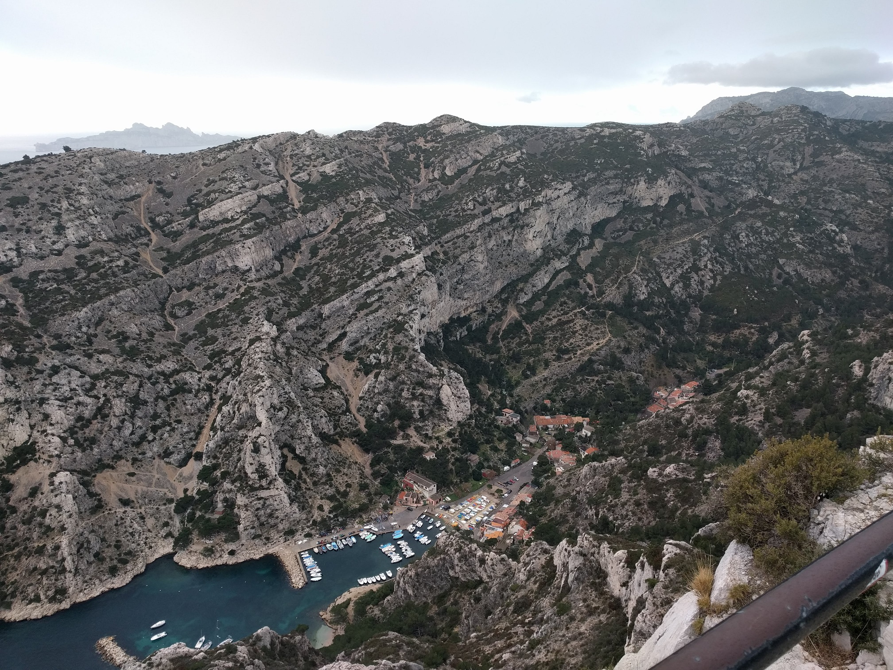

This week I am at the *Centre international de rencontres mathématiques* (CIRM) in Luminy.
I am attending and speaking at the ["Higher Structures" conference](https://conferences.cirm-math.fr/1959.html).
The whole event is wonderful!
I hope I am not too out of place among the big names in the speakers' list.
I've learned a lot of new math during the talks, as well as to speak with people who I hadn't had the chance to meet yet, or that I am not able to see very often.
I'd like to thank Bruno Vallette and all the organizers for giving me this opportunity.
<!--more-->

[(The slides of my talk are available there.)]()

<figure class="figure">

<figcaption class="figure-caption">Bonus: a picture taken from the top of the <em>Belvédère de Sugiton</em>, inside the <a href="https://en.wikipedia.org/wiki/Massif_des_Calanques"><em>Calanques</em></a>.</figcaption>
</figure>
