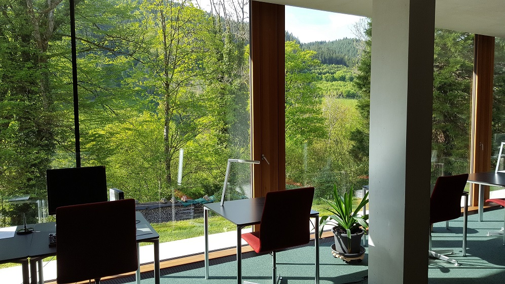

I just came back from the [Mathematisches Forschungsinstitut Oberwolfach](https://www.mfo.de/)!

I was there for the "[Factorization Algebras and Functorial Field Theories](https://www.mfo.de/occasion/1619/www_view)" workshop. It was an incredible experience. The talks were all, of course, very interesting, and I learned a lot about QFT. But more than that, I learned a lot speaking to the people about various research topics -- several people made several very interesting remarks to me, and others explained to me various points to mathematics that had remained obscure to me until this point.

The ambiance at the institute is amazing too. There were researchers from all around the world, and we were all there without hardly any external distractions: we all ate at the same times, slept in the same buildings... It was rather relaxed (like most mathematical conferences I went to, to be fair), and I particularly liked this informal session on Wednesday between 8PM and 10PM, during which anyone could walk up to the board and give a 5 min talk about whatever they wanted. It was really interesting to learn about all this research.

Of course I'm very grateful to the organizers for giving me the opportunity to come, in particular to [Owen Gwilliam](http://people.mpim-bonn.mpg.de/gwilliam/) (who is the one who invited me).
