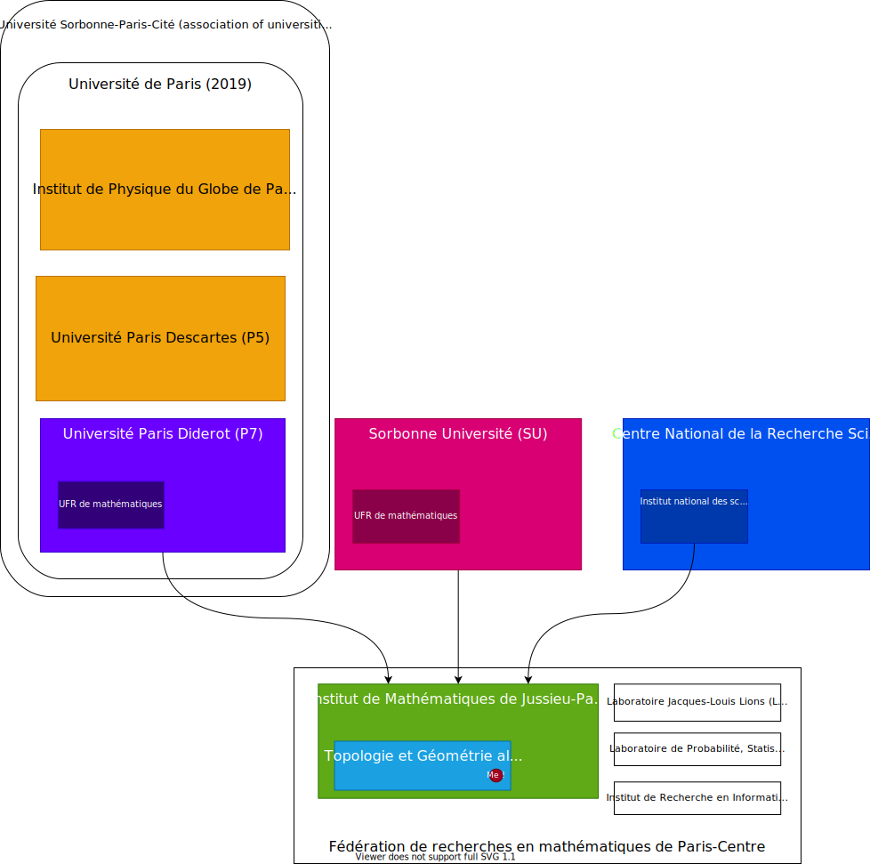
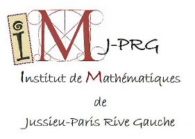

I finally got the confirmation from the ministry: I definitively got the job and I will be appointed in Paris-VII!
A new life is about to begin...

I've been at the Fields Institute (in Toronto) for a week now, to participate in the summer school on derived geometry and higher structures.
The lectures and talks are delightful!
This whole conference is impressive!
Hopefully my own talk yesterday was not out of place.
I also learned that some people actually do read my blog!
I was a bit surprised. So now I have the moral obligation to flesh out my posts a little.
Here's something that I hope people will find interesting.

<!--more-->

## The mille-feuille

<figure class="figure float-end">

<figcaption class="figure-caption">A <em>mille-feuille</em> (image from <a href="https://commons.wikimedia.org/wiki/File:Mille-feuille456.jpg">Wikipedia</a>).</figcaption>
</figure>

When I tell people I got the job, they usually ask me where I will be working.
This is a bit complicated: French academia is organized in many layers, and it is not easy to extricate what is going on.
A usual way to describe it is as a [_mille-feuille_](https://en.wikipedia.org/wiki/Mille-feuille), a typical French dessert that is supposedly made out of a thousands sheets of pastry.
So I will try to describe my own situation, hoping that it can help people trying to navigate French academia better.

**Update November 2018: today is holiday, it's raining outside and the temperature is about 10°C.
So I decided to make a diagram!
In bold are the organizations that I belong to.
I couldn't decide on a nice way to show that the research structures (the IMJ-PRG and the other labs) administratively depend on the two universities and the CNRS.**

<figure class="figure">

<figcaption class="figure-caption">A silly organizational chart.</figcaption>
</figure>

In France, almost all academics work in public institutions.
Permanent hires are actually civil servants.
I will be appointed in the _corps_ (group of civil servants) of _maître de conférences_ (MCF), the junior level (or "rank B") of the two levels of permanent faculty.
The other rank is _professeurs des universités_ (PR).
Since this is a national deal, I will be appointed by the Minister of Higher Education and Research, while professors are appointed by the President of the Republic.

I will then be assigned to a university.
In my case, Université Paris-VII (also known as Université Paris Diderot), who will be my actual employer and give me paychecks.
The university is itself part of bigger confederative structures (e.g. Paris-VII is part of _Sorbonne Paris Cité_, in association with some other universities), but it does not matter much right now.

Each university is subdivided in _composantes_ ("components").
Most of them are Teaching and Research Units (UFR).
Despite their name, these UFRs are almost exclusively devoted to the teaching side of the job, as well as managing things like buildings, office spaces, booking rooms...
I will obviously be assigned to the Mathematics UFR of Université Paris-VII.
A commission of the UFR is in charge of assigning teaching loads, and I already know mine for next year: lectures and exercise sessions of "Elementary algebra and calculus I", a first-year first-semester course (in addition to a smaller teaching load the second semester).

For the actual research, I will be assigned to the _Institut de Mathématiques de Jussieu--Paris Rive Gauche_ (IMJ-PRG).
The IMJ-PRG is a Mixed Research Unit (UMR), also colloquially known as a "lab".
These UMRs are created by a contract between a university and a national research organization, here the National Center for Scientific Research (CNRS).
The CNRS is a big, national umbrella organization that manages most of French scientific research.
Some other specialized institutes exists, e.g. INRIA for computer science.
The CNRS provides funds for travel, administrative personnel, computer equipment... and in exchange university research personnel works in a mixed university+CNRS unit.
The CNRS also hires some permanent researchers directly, as _chargés de recherches_ (scientist) and _directeurs de recherches_ (senior scientists), who have statuses approximately equivalent to _maître de conférences_ and _professeurs_ except they have no teaching duties.

The IMJ-PRG, which is devoted to fundamental mathematics, is even a somewhat special case: it is shared between the CNRS, Université Paris-VII, and Sorbonne Université.
It is a big organization, perhaps even the biggest math research unit in Europe, with more than 200 permanent researchers and 500 staff in total.
To deal with this, the IMJ-PRG is itself divided in twelve thematic team-projects, each with a head and a budget.
I will myself be part of the "Algebraic Topology and Geometry" team. There are other mathematics research units in Paris, five counting the IMJ-PRG, all part of the math research federation of Paris-center.
Other math research units are located in suburbs of Paris, such as the LAGA in Paris-XIII (north of Paris) or the IMO in Paris-XI (south of Paris).

Yes, this is complex, and it is not always easy to determine who does what and who to ask a question.
Fortunately, most of the administrative staff I have dealt with has been very nice and competent.
I tried to draw a diagram explaining all of this, but I eventually gave up.
Besides, that diagram will be obsolete in a few months: Paris-VII is merging with another university, Paris-V (AKA Paris-Descartes), to create a new big university with a yet unknown name, much like what was formerly known as Paris-VI (Université Pierre et Marie Curie, that you perhaps know as "Jussieu") merged with Paris-IV to create "_Sorbonne Université_" (yes, the name in French follows the English word order -- don't ask me why[^1]).
While the research side of the story will probably not be affected, teaching certainly will.

I have been told that the true test of one's bureaucratic mettle is the habilitation (HDR), the diploma which allows you to supervise doctoral students alone and to apply for full professor positions.
Since you have no advisor to guide you through the administration, it can get... interesting.
As a funny anecdote, someone once told me that through a complex network of signature delegations and counter-signatures, he was the one required to eventually authorize his own habilitation defense.
This was of course unacceptable and was resolved in a different way, but still, interesting things can happen.

[^1]: Update August 2018: I have learned why. The IDEX grant (see the last part of [my previous post]()) which was the main driving force behind the creation of _Sorbonne Université_ was entitled _Sorbonne Universités à Paris pour l'Enseignement et la Recherche_ ("Sorbonne Universities in Paris for Education and Research"). Its acronym is SUPER (note that it is basically mandatory for all ANR projects to have an acronym). I imagine that "USPER" was less catchy.   Update 2: well, apparently it also stems from a dispute between the university and the local government in Paris. The local government did not want one university to monopolize the name "Sorbonne", and the "compromise" that was reached was the name "Université Sorbonne-Université". What can I say... politics can be intricate sometimes.
